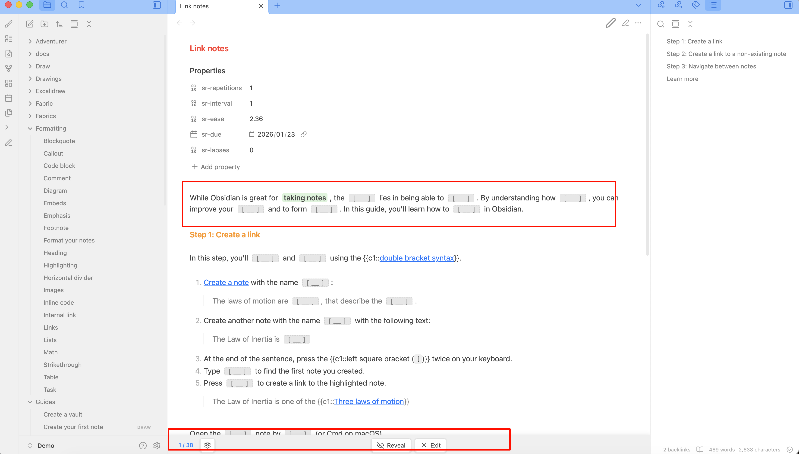
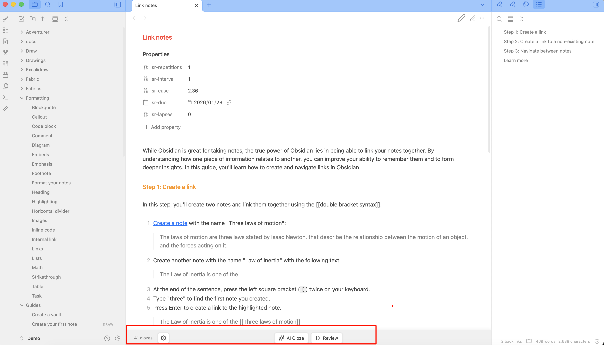
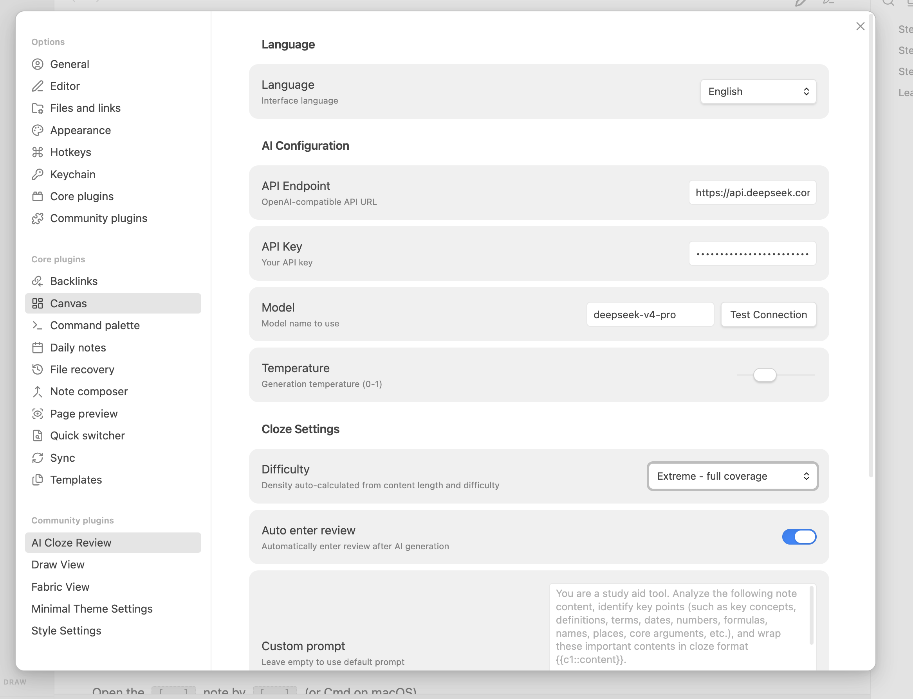

# AI 挖空复习 (AI Cloze Review)

[English](./README.md)

AI 驱动的挖空复习插件，一键 AI 分析笔记生成填空内容，交互式复习，点击显示答案。

## 功能特点

- **AI 生成挖空** — 一键 AI 分析笔记，自动识别重点内容并生成挖空
- **即时复习模式** — 隐藏挖空答案，点击显示，追踪进度（已揭示/总数）
- **不修改原文** — 所有挖空内容缓存在内存中，笔记原文保持不变
- **自适应密度** — 根据笔记长度和难度自动计算挖空数量（简单/中等/困难/超密集）
- **底部工具栏** — 快速操作：AI 挖空、切换复习、显示/重置答案、退出复习
- **Readable Line Length 适配** — 尊重 Obsidian 的可读行宽设置
- **移动端优化** — 小屏设备自动切换为纯图标按钮，节省空间
- **多 API 支持** — 支持 OpenAI、DeepSeek、智谱、Moonshot、Ollama 及任何 OpenAI 兼容 API
- **中英文切换** — 自动检测 Obsidian 界面语言，设置中可手动切换

## 使用方法

1. 在设置中**配置 API**（端点、密钥、模型）
2. 点击 **AI 挖空** 为当前笔记生成挖空内容
3. AI 自动进入复习模式，答案隐藏为空白
4. **点击**空白处显示答案
5. 使用**显示答案**一键全部显示，**重置**重新隐藏
6. 点击**退出复习**恢复原始笔记视图

## 截图







## 挖空语法

```
{{c1::关键内容}}          — 基本挖空
{{c1::答案::提示}}         — 带提示的挖空
```

复习模式下，挖空答案隐藏为 `［ ］` 占位符，点击即可显示。

## 安装

### 通过 Obsidian 社区插件市场（即将上线）

1. 打开设置 → 第三方插件
2. 浏览并安装 "AI Cloze Review"
3. 配置 API 设置

### 手动安装

1. 从 [最新 Release](https://github.com/liufree/ai-cloze-review/releases) 下载 `main.js`、`manifest.json`、`styles.css`
2. 放入 `{你的库}/.obsidian/plugins/ai-cloze-review/`
3. 在设置 → 第三方插件中启用

## 设置

| 设置项 | 说明 | 默认值 |
|--------|------|--------|
| 语言 | 界面语言（自动/中文/English） | 自动检测 |
| API 端点 | OpenAI 兼容的 API 地址 | `https://api.openai.com/v1/chat/completions` |
| API Key | API 密钥 | — |
| 模型 | 使用的模型名称 | `gpt-4o-mini` |
| 温度 | 生成温度 (0-1) | `0.3` |
| 难度 | 挖空密度：简单/中等/困难/超密集 | `中等` |
| 自动进入复习 | AI 生成后自动进入复习模式 | `true` |
| 自定义提示词 | 自定义 AI 提示词 | 默认提示词 |

## 难度与密度

挖空数量根据笔记长度自动计算：

| 难度 | 密度 | 3000 字示例 |
|------|------|------------|
| 简单 | 250 字/个 | ~12 个 |
| 中等 | 120 字/个 | ~25 个 |
| 困难 | 60 字/个 | ~50 个 |
| 超密集 | 30 字/个 | ~100 个 |

## 开发

```bash
npm install
npm run build   # 生产构建
npm run dev     # 开发模式（监听文件变化）
```

## 开源协议

MIT
